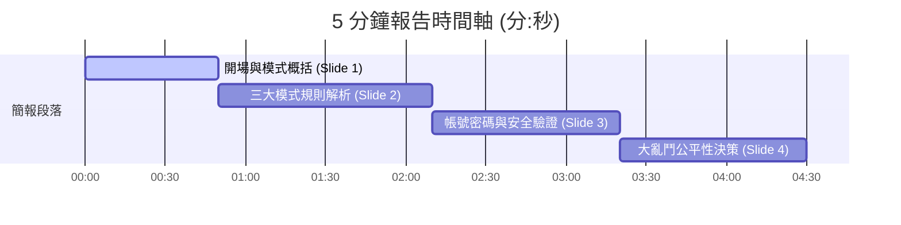

# 🎮 Wordle 多人連線搶分戰 — 5 分鐘報告指南 (模式規則強化版)

本版本已**移除區網連線設定**，並將核心聚焦於**「三大遊戲模式的詳細規則」**。整體報告時長規劃為 **4 分 30 秒**（預留 30 秒彈性時間），確保您在 5 分鐘上限內精準唸完。

---

## ⏱️ 5 分鐘時間精準配比 (Total: 4m 30s)

*   **Slide 1：開場與專案概括** ➔ `00:00 - 00:50` (50秒)
*   **Slide 2：三大模式規則詳細解析** ➔ `00:50 - 02:10` (1分20秒)
*   **Slide 3：帳號安全與資料庫管理** ➔ `02:10 - 03:20` (1分10秒)
*   **Slide 4：大亂鬥公平性與賽局設計** ➔ `03:20 - 04:30` (1分10秒)
*   **預留彈性緩衝** ➔ `04:30 - 05:00` (30秒)

---

## 🗂️ 投影片內容與口說逐字稿

### 🖥️ Slide 1：開場自我介紹與系統功能概括
*   **簡報展示要點**：
    *   **專案名稱**：Wordle 多人連線搶分戰 (Flask + Socket.IO + SQLite)
    *   **技術特點**：全網頁響應式設計、伺服器端狀態同步、QWERTY 互動式虛擬鍵盤。
    *   **三大遊戲模式**：
        1.  **單人自主練習**（個人自我特訓）
        2.  **多人限時狂熱賽**（獨立單字，限時競速）
        3.  **同題搶答大亂鬥**（共享網格，同題競速）
*   **⏱️ 目標時間**：`00:00 - 00:50` (50 秒)

> **🗣️ 口說講稿：**
> 
> 「教授、同學們好，我是第一位報告人 劉晉維，今天將由我為大家介紹我們的期末專題——『Wordle 多人連線搶分戰』。
> 
> 相信大家都聽過或玩過經典的 Wordle，但**傳統的 Wordle 主要是單機、非同步的個人解謎**。而我們這款專案則是透過 **Flask、Socket.IO 與 SQLite**，將其徹底改造成**支援多人、跨平台、且完全即時同步連線的競技遊戲**！
> 
> 我們的系統主要設計了三種不同的玩法模式：包含經典的單機練習、多人限時狂熱賽，以及極具競爭感的同題搶答大亂鬥。同時，我們也為行動裝置打造了高質感的虛擬鍵盤與響應式介面，讓每位玩家不管是使用手機、平板還是電腦，都能獲得流暢的競技手感。」

---

### 🖥️ Slide 2：三大模式規則詳細解析 (重點)
*   **簡報展示要點**：
    *   **🎮 單人自主練習 (Classic Single Mode)**：
        *   建立專屬包廂，每題限制猜測 6 次。
        *   猜對得分並自動隨機換題（系統過濾連續重複字）；猜錯滿 6 次則自動切換下一題。
    *   **⚡ 多人限時狂熱賽 (Frenzy Mode)**：
        *   多人在線競速，倒數 **3分鐘**。每位玩家有各自獨立的單字題庫。
        *   每猜對一題得 1 分並自動跳下一題；答對時會向全體廣播計分板。
        *   遇到難題可點擊「Skip」放棄，不加分直接換題。時間到由伺服器結算最高分者獲勝。
    *   **⚔️ 同題搶答大亂鬥 (Shared Grid Battle)**：
        *   進行 **3 回合**，每回合限時 3 分鐘。全場玩家面對**同一道謎題**。
        *   首位猜中者奪得該回合點數 (+1 分)。當有人答對或全員猜測次數用盡時，回合隨即結束。
*   **⏱️ 目標時間**：`00:50 - 02:10` (1 分 20 秒)
*   **💡 報告建議**：用手指著投影片中三種模式的圖表，節奏分明地說明規則。

> **🗣️ 口說講稿：**
> 
> 「接下來為大家詳細解析這三個模式的規則細節：
> 
> 第一是**單人自主練習**。這保留了經典單機 Wordle 的規則，主要供玩家自我特訓，每題上限 6 次猜測。答對或放棄後，後端會自動隨機抽新詞庫且去重換題，無縫進入下一關。
> 
> 第二是**多人限時狂熱賽**。這是多人競速的遊戲模式，倒數 3 分鐘內，每位玩家擁有各自獨立的謎題。答對即可獲得 1 分，系統會即時廣播更新大廳計分板，看誰在限時內解出最多題目，十分刺激。
> 
> 第三是我們的重頭戲：**同題搶答大亂鬥**。這是一個多人共享網格的 3 回合競速模式。所有在線玩家都看同一道題目，且共用一個作答大螢幕。玩家在獨立草稿區打字，送出後的線索會呈現在共享網格上。任何人只要率先猜出全綠正確字，就能奪下回合分數。這個模式大大增加了玩家之間的即時博弈，也完美翻轉了傳統 Wordle 單機解謎的孤單體驗。」

---

### 🖥️ Slide 3：帳號安全與資料庫管理 (技術細節)
*   **簡報展示要點**：
    *   **資料庫架構**：採用 **SQLite** 搭配 **SQLAlchemy ORM**。
    *   **資料表設計**：
        *   [`Player`](file:///d:/My_data/projects/wordle_game/app/models/orm.py#L8) 表：儲存玩家資訊、密碼雜湊與各模式勝場。
        *   [`GameRecord`](file:///d:/My_data/projects/wordle_game/app/models/orm.py#L19) 表：紀錄遊玩紀錄與是否獲勝的標記。
    *   **安全防護機制**：
        *   使用 `pbkdf2:sha256` 進行**密碼單向雜湊加密**，保障用戶隱私。
        *   **後端 Session 身分校驗**：不依賴前端傳送的帳號，Socket 通訊一律讀取後端加密 Flask Session。杜絕玩家在瀏覽器 Console 修改 `currentUser` 假冒他人提交答案或退房的漏洞。
        *   **多帳號登入 Socket 重連**：強制在登入後重連 Socket，以更新握手 Session，解決多分頁測試時 Cookie 覆蓋的問題。
*   **⏱️ 目標時間**：`02:10 - 03:20` (1 分 10 秒)

> **🗣️ 口說講稿：**
> 
> 「為了支撐這些遊戲模式，我們實作了完善的**帳號安全與資料庫管理**。
> 
> 我們採用輕量且效能優秀的 **SQLite** 資料庫，並使用 **SQLAlchemy ORM** 進行資料操作。我們設計了玩家表與紀錄表兩張核心表格，詳細記錄每一局的戰績。
> 
> 在安全性上，我們實作了三大機制：
> 首先，使用 `pbkdf2:sha256` 對密碼進行單向雜湊加密後才寫入資料庫。
> 其次，為了防止作弊，我們強制透過後端加密 Flask Session 來驗證玩家身分。所有 Socket 事件都直接從伺服器端讀取登入帳號，徹底封殺了玩家透過瀏覽器 Console 修改前端變數來假冒他人提交答案的漏洞。
> 最後，我們也加入了登入時 Socket 自動重連機制，解決了開發測試時多帳號分頁之間 Cookie 覆蓋的問題。」

---

### 🖥️ Slide 4：設計演進 — 同題搶答大亂鬥的公平性決策
*   **簡報展示要點**：
    *   **原始規劃**：全體共用猜測次數（例如整房共用6次）或玩家輪流猜測。
    *   **放棄理由 (不公平性)**：
        *   *搭便車效應 (Free-rider Effect)* ➔ 先猜的人給後者送線索，後面的人無痛撿尾刀。
        *   *惡意洗板* ➔ 隨意胡亂猜測，耗光全場機會。
    *   **最終公平方案 — 賽局平衡**：
        *   **個人獨立次數限制**：每位玩家每回合獨立限猜 6 次合法單字（草稿區黃色虛線隔離輸入，防止多人在同一行鍵盤衝突）。
        *   **共享大網格動態增長**：取消全場次數限制，網格向下無限滑動。
        *   **實時競速博弈**：你等別人的線索，答案就會被搶走；你如果先猜，又會暴露線索給對手。玩家必須在速度、詞彙量和出手時機上進行心理博弈，徹底解決了公平性問題。
*   **⏱️ 目標時間**：`03:20 - 04:30` (1 分 10 秒)

> **🗣️ 口說講稿：**
> 
> 「最後，我想跟大家分享大亂鬥模式在遊戲設計上的重要演進。
> 
> 在大亂鬥中，所有在線玩家共享同一個大作答網格。起初，我們曾規劃『全體共用6次限制』或『大家輪流猜測』。但在討論後，我們發現這極度不公平。
> 
> 因為在 Wordle 中，每一次猜測都會透露大量的黃綠燈位置線索。如果輪流或共用次數，會產生嚴重的『搭便車效應』。也就是說，玩家 A 動腦排除字母、提供關鍵線索，卻被順位在後的玩家 B 輕鬆撿尾刀拿分，這會導致大家都不願意先猜；甚至有玩家會惡意亂猜消耗全場次數來破壞體驗。
> 
> 為了公平性，我們修改為**『個人草稿隔離、每人獨立限猜 6 次』**，大網格行數也改為無上限、動態向下滾動。
> 
> 這樣的設計創造了完美的『賽局博弈』：你如果太早猜，可能會給對手線索；但如果你一直等別人猜，別人隨時可能搶答成功。玩家必須在速度、詞彙量和出手時機上進行決策。這項改進解決了不公平，也讓遊戲對抗性達到最高峰。
> 
> 以上是我的報告，接下來將交給下一位組員，為大家深度解析後端程式碼細節，謝謝大家！」

---

## 📈 報告時間監控檢查點 (Cue Cards)

在錄影時，請確保您的視線隨時關注時間：

*   **[ 00:50 ]** 結束 Slide 1（自我介紹與模式概括）➔ 進入 Slide 2（三大模式規則）。
*   **[ 02:10 ]** 結束 Slide 2（規則解析）➔ 進入 Slide 3（帳號與資料庫安全）。
*   **[ 03:20 ]** 結束 Slide 3（技術細節）➔ 進入 Slide 4（大亂鬥公平性）。
*   **[ 04:30 ]** 完美結束報告並交棒給同學，整體錄影時間絕不超時。
